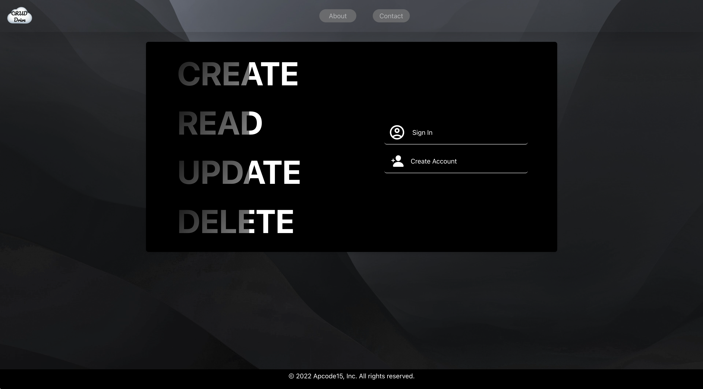
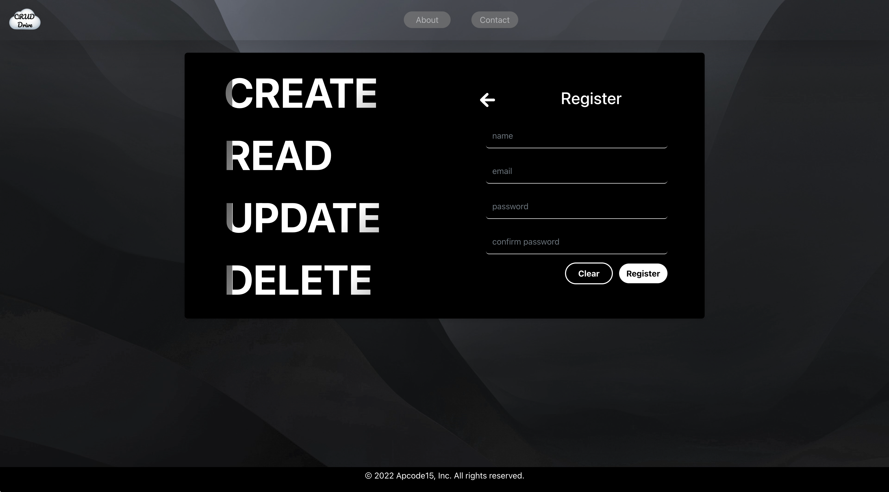
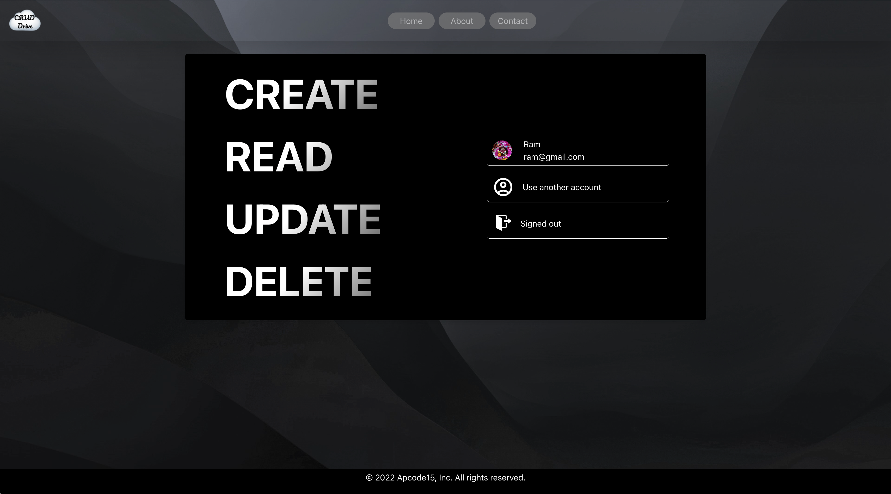
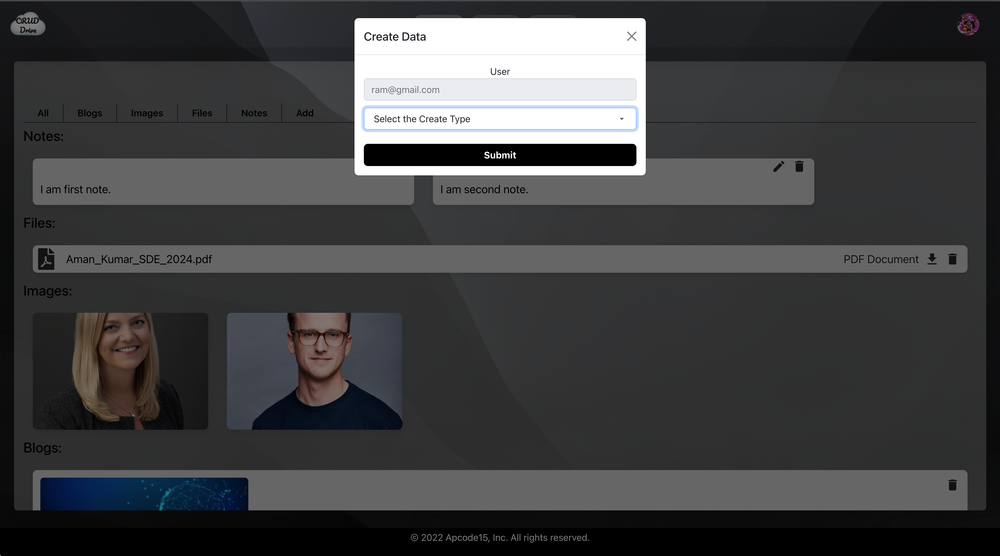
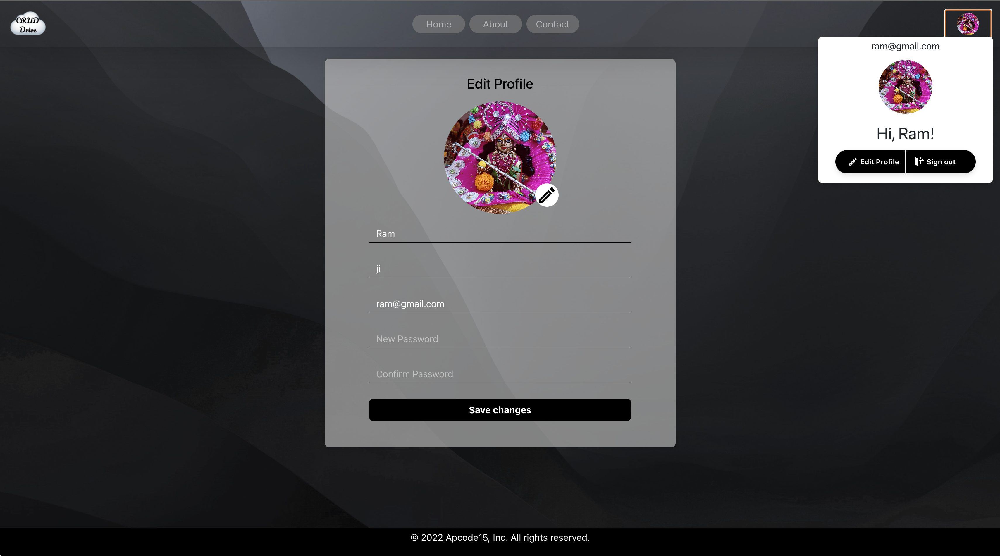

# client-DIC

- Client-DIC is the frontend part of Deep-into-CRID.
- This project is for Storing images, Blogs, Forms, and Notes with an attractive UI ‘website’.
- The app should be responsive in portrait mode and placed horizontally when in landscape mode.
- Implemented CRUD(Create Read Update and Delete) operations on various collections such as users of the database.
- Rendered the stored data ‘filtered’ on the basis of the type of data during selected images, blogs, etc.
- Implemented user authentication and ACID properties.
- Different levels of access for normal users.
- Techs Involved - ReactJS | Redux | Git | HTML

### Detailed Design:

- Built the app using react functional components with hooks to handle state and other life cycle methods
- App component acts as the core parent component of the application, it takes care of loading the initial state, and data communication and also handles how the data gets propagated to various underlying components
- Kept the layout of the application simple to have any modification or enhancement in future to evolve the layout as required

## Image UI
Following are the screenshot of the application:

### Home Page
- This is the home page i.e. first page.

### Dashboard

- This is the dashboard.

### Create Modal

- This is create modal.

### Edit Profile page

- User can edit profile.

### Contact Page

- This is contact page to mail direct organizer.

## How to Run the Application:

Clone the repo and set up the application

- git clone [https://github.com/amankumar-2001/deep-into-crud](https://github.com/amankumar-2001/client-DIC.git)
- cd client-DIC
- npm install
- npm start

## Application Link

- Application link deployed on Vercel: https://client-dic.vercel.app/
## Author

- [@amankumar-2001](https://www.github.com/amankumar-2001)

